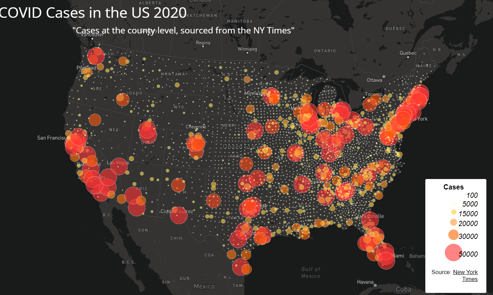
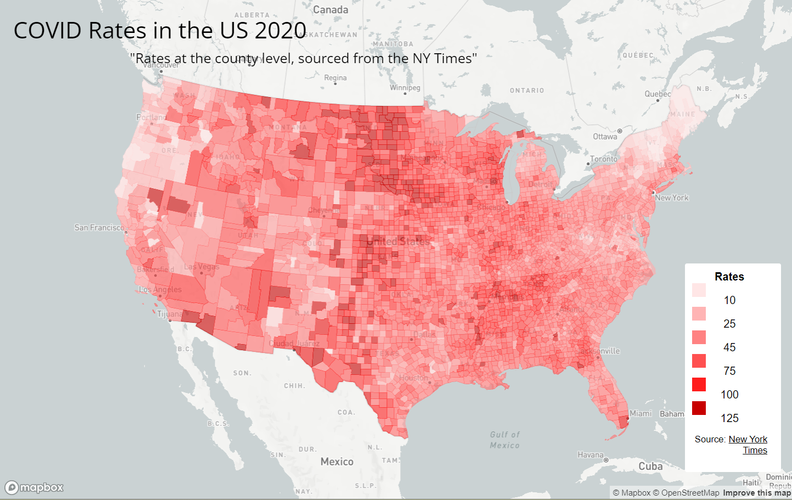

# COVID-Visualizations

## Overview
COVID Visualizations is a mapping project that visualizes COVID-19 case rates at the county level in the United States for the year 2020. The map uses proportional and chloropleth representations to showcase variations in case rates, providing insights into the impact of the pandemic across different regions.

## Map Links
- [Link to Map 1: Proportional Cases](https://eazebra.github.io/COVID-Visualizations/map1/map1.html)
- [Link to Map 2: Chloropleth Rates](https://eazebra.github.io/COVID-Visualizations/map2/map2.html)

## Screenshots

## Primary Functions
- **Choropleth Map Visualization:** Display COVID-19 case rates using a color-coded map.
- **Proportional Symbol Map:** Represent the number of cases through proportional circle symbols.

## Libraries in Use
- [Mapbox](https://www.mapbox.com/): For creating interactive and customizable maps.

## Data Sources
- COVID-19 case/death data: [The New York Times (2020)](https://github.com/nytimes/covid-19-data/blob/43d32dde2f87bd4dafbb7d23f5d9e878124018b8/live/us-counties.csv).
- Population data: [2018 ACS 5-year estimates](https://data.census.gov/cedsci/table?g=0100000US.050000&d=ACS%205-Year%20Estimates%20Data%20Profiles&tid=ACSDP5Y2018.DP05&hidePreview=true).
- U.S. county boundary shapefile: [U.S. Census Bureau](https://www.census.gov/geographies/mapping-files/time-series/geo/carto-boundary-file.html).

## Credit and Acknowledgment
- The New York Times for providing the original COVID-19 data.
- U.S. Census Bureau for the county boundary shapefile.
- GEOG 458 team for processing shapefile data prior.

## Additional Information
- The case rate is calculated as cases per thousand residents.
- The project includes multiple maps, each offering unique insights.

## How to Run Locally
1. Clone this repository.
2. Open the `map1.html` or `map2.html` file in a web browser.

Feel free to explore the maps and gain valuable insights into the COVID-19 impact across different U.S. counties.

---
